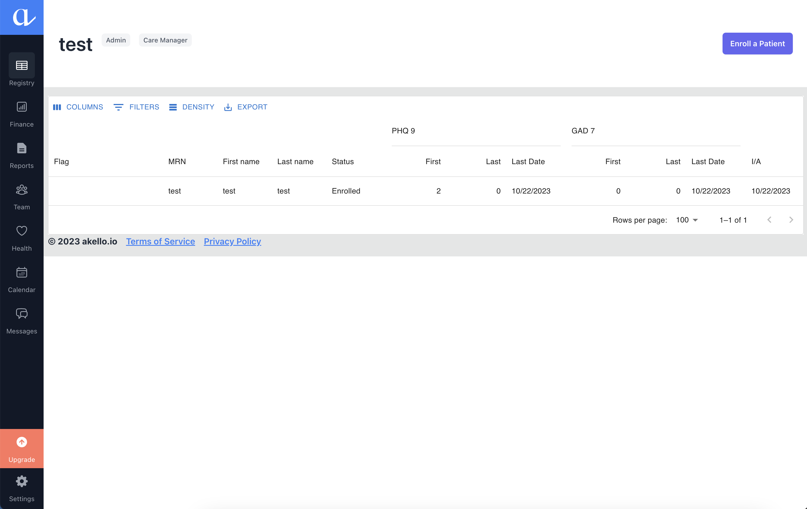

<h1 align="center">Foo CoCM Registry</h1>
<p align="center">A free and open-source healthcare webapp to run Collaborative Care from the Akello team.</p>
<p align="center">
  <a href="https://github.com/medplum/foomedical/actions">
    
  </a>
  <a href="https://github.com/medplum/foomedical/blob/main/LICENSE.txt">
    
  </a>
  <a href="https://sonarcloud.io/project/overview?id=medplum_foomedical">
    
  </a>
</p>



### What is Foo Medical?

### Features

- patient referrals
- measurement based care

Foo Medical is designed to be forked and customized for your business' needs. Register on [foomedical.com](https://foomedical.com/) to see it in action.

### Getting Started

First, fork and clone the repo.

Next, install the server from your terminal

```bash
cd packages/server 
python -m venv venv
source venv/bin/activate
pip install -r requirements.txt
uvicorn main:app --reload
```
The server will be running on `http://localhost:8000/`

Then, run the app!

```bash
cd packages/apps/cocm-registry
npm install
npm run start
```

This app should run on `http://localhost:3000/`

Log into the app on localhost using the same credentials you created on [foomedical.com](https://foomedical.com/) and you are ready to start customizing.

